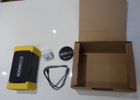
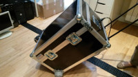

**The KoomBook is a project following the creation of the first Ideas Boxes.**

Goals of Libraries Without Borders' KoomBook:
* Mobile
* Easy to use 
* Autonomous energy source 
* Low cost 

## Two versions
** This project includes two versions: **  
 - ** The bare KoomBook ** :  
  
  Includes one KoomBook, a USB cord, and an instructions guide  
 - ** The Flightcase KoomBook** :  
  
  Includes one box capable of holding 10 tablets, a KoomBook, and a power unit to recharge the kit, all on an easy, rolling base. Variations on this box are equipped to stow 12 inch computers. Find out extensive information on the [KoomBook Kit documentation](http://koombook-kit.doc.bibliosansfrontieres.org/)