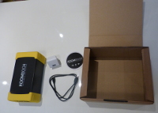

**Le KoomBook est un projet initié suite à la sortie des premières IdeasBox.**

En effet à cette époque Bibliothèques Sans Frontières souhaitait se doter d'un nouvel outil :

* Mobile
* Facile à déployer
* Autonome en énergie
* A bas coût

## Deux versions

**Le projet se décline en deux versions : **

* **KoomBook nu** :  
    
  Un KoomBook, une alimentation USB et une documentation d'utilisation
* **Flightcase KoomBook** :  
    
  Il s'agit d'une box pouvant contenir 10 tablettes, un KoomBook et un module de recharge. Le tout sur roulette il est possible de l’emmener partout très facilement. Des variantes, peuvent embarquer des ordinateurs 12 pouces. Retrouvez plus d'informations sur la [documentation du kit KoomBook](http://koombook
