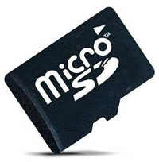
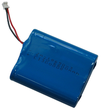

[Téléchargez le guide rapide d'utilisation](http://filer.bsf-intranet.org/koombook-guide-RV-KBcampus-new.pdf) pour une première prise en main

## Objectifs pédagogiques

* Comprendre le fonctionnement du KoomBook, ses principales caractéristiques et ses cas d'usages
* Savoir se connecter au hotspot KoomBook
* Savoir l'utiliser conjointement avec des appareils mobiles
* Apprendre à utiliser le media-center et la zone d'administration
* Connaître les principales étapes de maintenance de l'appareil

## Le KoomBook...

* KoomBook vient du terme swahili KUMBUKA qui signifie « se souvenir »
* Spécificités du boîtier : 1 bouton on\/off, 1 LED, 1 micro USB, 1 prise réseau
* Nombre d'utilisateur : Une quinzaine selon les usages et l'activité des utilisateurs
* Autonomie : de 3h à 5h \(selon usage\) 
* Stockage : de 16Go \(carte SD\) à 500Go \(disque dur ou disque SSD\)
* Portée : 10m à 30m selon l'environnement, par ex : type de mur \(brique, beton, etc.\)

## Un système client\/serveur

* L'ensemble des données se trouvent sur le disque dur du KoomBook
* Tout comme une Box Internet, le KoomBook créé un hotspot wifi
* Les utilisateurs se connectent au KoomBook et consultent les données enregistrées sur le disque dur.
  

## Composition du KoomBook

* Un nano-ordinateur \(Processeur : 1Ghz, 1Go de RAM\)  
  
* Un disque dur \(capacité 500Go\)  
  
* Une carte miscro SD \(capacité 16Go\)   
  
* Deux émetteurs\/récepteurs wifi \(porté ~ 30m, 10 utilisateurs\)  
  
* Une batterie \(entre 3 et 5h d'autonomie\)

  

* Une alimentation \(secteur 220v - 5V USB\)

> > > > >  Attention : Le boîtier contient un élément sensible aux chocs, le disque dur. Le boîtier n'est pas étanche, attention  à l'eau et à la poussière.

## Liste du matériel

Retrouvez la liste complète du matériel sur le document [**Montage d'un KoomBook**](http://assemblage-koombook.doc.bibliosansfrontieres.org/fr/composants)

## Chargement, mise en marche

* Charge complète : 6h.
  Si la batterie a été déchargée complètement, le chargement complet de la batterie sera un peu plus long
* Privilégier un rechargement hors du soleil et à température modéré, 25-30°C max
* Chargeur micro USB universel type téléphone mobile 5V – 2A \(fournie\)
* Batterie Lithium 3,7V \/ 7600mAh
* Bouton en façade, appuyer 2s pour allumer le dispositif, 1 min 15s pour démarrer

## Maintenance et mise à jour

* Le boîtier peut être ouvert au besoin  
>>>> Tous les éléments à l'intérieur sont fragiles et doivent être manipulés avec précautions

* La mise à jour du KoomBook se fait via Internet. 
  Aucune action n'est requise de votre part. Connectez simplement votre appareil à votre box ADSL avec un câble réseau Ethernet RJ45 et allumez-le. La mise à jour du KoomBook se fera automatiquement.

## Connexion au hotspot wifi

* Activez le wifi sur votre tablette\/ordinateur
* Repérez et connectez-vous au hotspot wifi KoomBook
* Entrez la clé wifi \(référez-vous au guide utilisateur fourni lors de la remise du KoomBook\)
* Ouvrez un navigateur à l'URL suivante 
  \(ne pas oublier le http://\) [http://koombook.lan](http://koombook.lan)

## Précautions d'utilisation

Quelques précautions d'utilisations pour une plus longue durée de vie

* Placer le KoomBook dans un endroit frais de préférence
* Ne pas exposer au soleil
* Manier avec précautions, le KoomBook contient un disque dur \(sensible aux choc\)
* Attention à la prise micro-usb lors du branchement de l'alimentation \(fragile\)
* Pour connecter le Koombook à internet, privilégier le réseau filaire, le wifi ayant une porté et un débit limités

