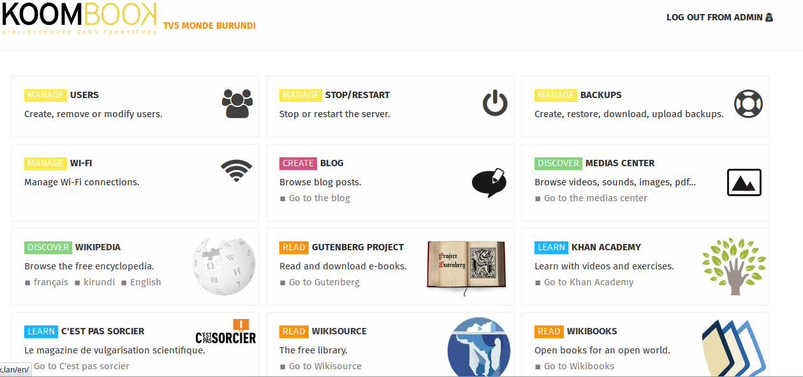

# The Ideascube portal 
Ideascube is a content portal that offers digital resources, (books, multimedia files, videos), sites (Wikipedia, the Gutenberg Project, Wikisource) and training tools (MooCs) capable of being consulted offline. Once connected to the Internet, the KoomBook can update pre-loaded resources and download new ones. Ideascube is the software that powers the KoomBook. 

[Browse the Ideascube handbook](http://ideascube.doc.bibliosansfrontieres.org/)

