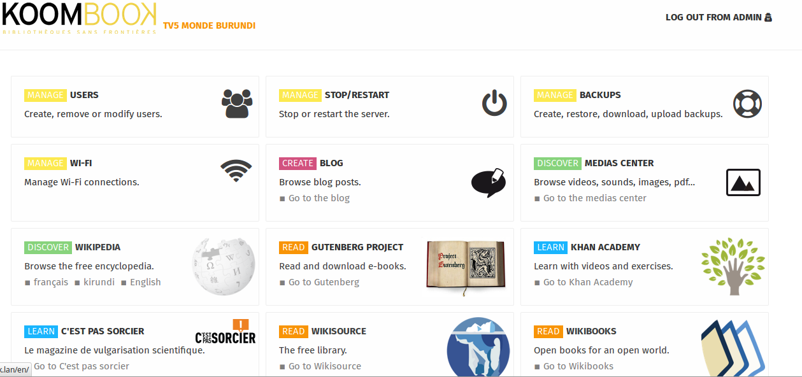

# Le portail Ideascube

Ideascube est un portail  de contenus qui propose des ressources documentaires numériques \(livres, fichiers multimédia, vidéos\), des sites \(Wikipedia, le projet Gutenberg, Wikisource\) et des outils de formation initiale et continue \(Moocs\) consultables hors ligne. Une fois connecté à Internet, le Koombook peut mettre à jours les resssources déjà installées et en télécharger de nouvelles. Ideascube est le logiciel qui permet au KoomBook de fonctionner.

[Parcourir le manuel utilisateur et administrateur d'Ideascube](http://ideascube.doc.bibliosansfrontieres.org/)

