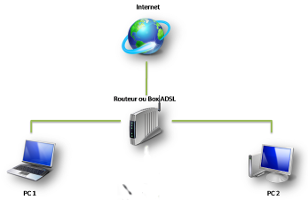
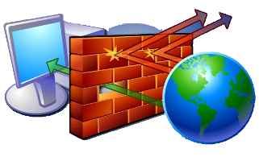

## Infrastructure réseau
D'un réseau à un autre les infrastructures réseaux peuvent comporter des différences
- Le type de réseau : filaire (Ethernet), radio (wifi) ou en encore CPL (courant porteur en ligne)
- Le débit : en réseau filaire (10, 100, 1000 Mb/s) ou en wifi (11, 54 ou 454 Mb/s)
- La qualité : perturbation électrique, coupure fréquente, ligne de mauvaise qualité, etc.

## Particularités des réseaux
Le réseau local privé peut être relié directement à Internet au moyen d'un modem ADSL

---

Le pare-feu de votre l'infrastructure peut bloquer l'accès à certains protocole

---

Un proxy, peut filtrer l'accès à certains site

## Services d'un réseau local

**Un réseau local dispose au minimum des services suivants pour fonctionner**
- **Un serveur DHCP** pour attribuer de manière automatique une adresse IP à chaque nouvel équipement introduit dans le réseau
- **Un serveur DNS** capable de résoudre les noms des machines du réseau privé local. Il peut également résoudre d'autres noms de domaines en passant la requête à un autre serveur DNS sur Internet.

**On peut également trouver **  
- **Un pare-feu** pour filtrer les communications entrantes et sortantes au moyen de règles définies par un protocole, une adresse IP, etc.
- **Un proxy** pour filtrer l'accès web au moyen de règles définies par des adresses Internet ou des mots clés